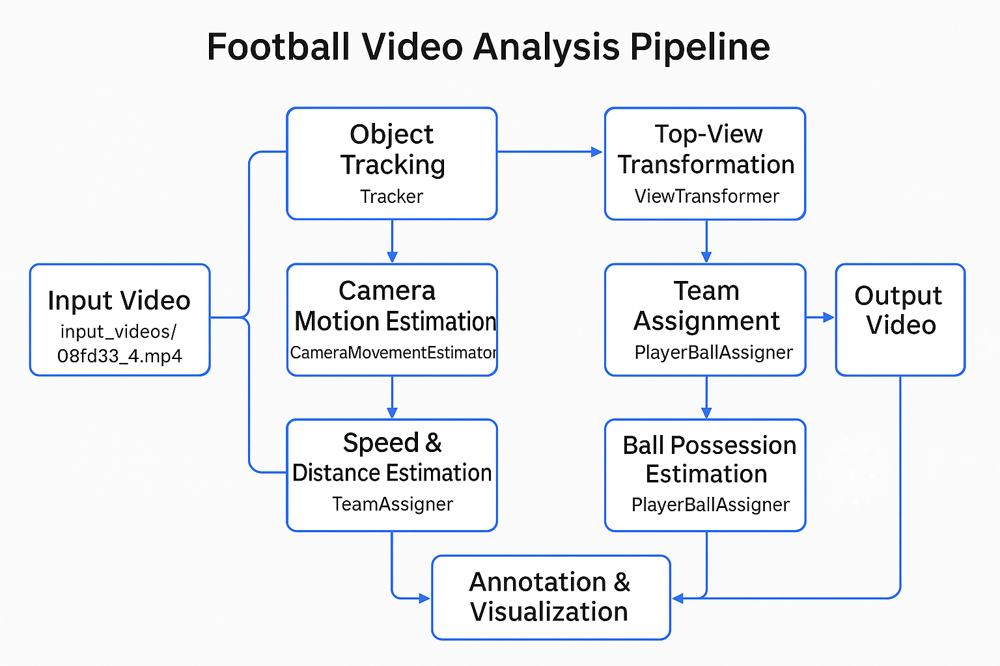

# Football Analytics Pipeline

## Introduction
This project is a football video analysis pipeline using machine learning and computer vision:

- **Object Detection:** YOLOv5x model detects players, ball, referees, and goalkeepers.
- **Multi-object Tracking:** Tracks objects across frames for consistent identities.
- **Camera Motion Estimation:** Compensates for camera movement using vision algorithms.
- **Bird’s Eye View Transformation:** Maps positions to a top-down field view.
- **Speed & Distance Estimation:** Calculates movement metrics from tracking data.
- **Team Classification & Ball Possession:** Classifies teams and assigns ball possession using learned features.

Combines deep learning and classical methods for accurate football match analysis.



## Setup

```
git clone https://github.com/anubhab7111/football-analysis.git
cd football-analysis
pip install -r requirements.txt
```

## Inference

1. Download the pretrained model [`best.pt`] from:
   [drive](https://drive.google.com/file/d/1ERZWbp5-XjdH811217glvxjLTn8KuvSY/view?usp=sharinghttps:/)
2. Place it in the `models/` folder.
3. Run the script:

   ```bash
   python main.py
   ```

## Model Performance (YOLOv5x)

| Class       | Precision | Recall | mAP@0.5 | mAP@0.5:0.95 |
|-------------|-----------|--------|---------|--------------|
| **Player**      | 0.963     | 0.964  | 0.981   | 0.787        |
| **Goalkeeper**  | 0.843     | 0.992  | 0.968   | 0.740        |
| **Referee**     | 0.917     | 0.888  | 0.938   | 0.665        |
| **Ball**        | 0.927     | 0.229  | 0.486   | 0.194        |
